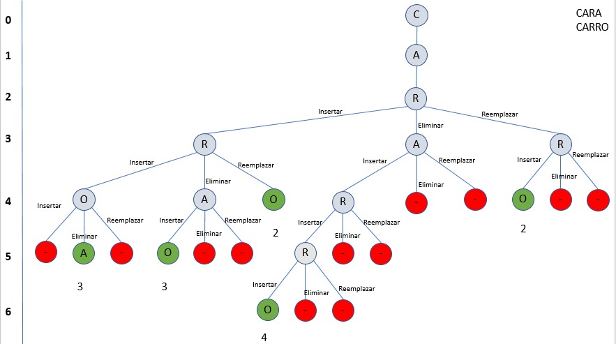

# TPO Programación 3 - Backtracking - UADE 2021

## Enunciado

Existen muchos casos en los cuales, por errores de tipeo en base a la proximidad de las teclas en un teclado, dos string que son diferentes en realidad pueden ser el mismo si se sustituyen, insertan o eliminan letras.  

El problema a resolver consiste en: dada una cadena de entrada s y un conjunto de cadenas C, determinar qué cadena de C es la más cercana a s, y de esa cadena más cercana mostrar el número mínimo de sustituciones, inserciones o eliminaciones que se deben llevar a cabo para transformarla en s.  

### Ejemplo  

Si se tienen las cadenas `c1` y `c2`, en donde `c1` es la palabra “CARA” y `c2` es la palabra “CARRO”,
Para llegar de CARA a CARRO es suficiente con insertar la letra **R** despues de la primera **A** y sustituir la segunda letra **A** por la letra **O** en cuyo caso la distancia sería `2`.

## Resolución

El método aplicado es el de **Backtracking** en el cual en cada nivel del llamado recursivo se comparan los caracteres correspondientes al indice del nivel actual en las dos cadenas. Si son iguales los caracteres en las dos cadenas se hace el llamado recursivo sin modificar nada, sino se realizan las siguientes tres acciones:

- Reemplazar un caracter en la cadena base por el de la cadena objetivo en el mismo indice.
- Insertar en la cadena base el caracter de la cadena objetivo en el mismo indice.
- Eliminar de la cadena base el caracter en el indice correspondiente al nivel.

Cada una seguida de su correspondiente llamado recursivo sumando un nivel.

*Diagrama de la estrategia utilizada*  
[Implementacion del algoritmo `distanciaEntreDos`](https://github.com/diegoasanch/TPO_Programacion_3/blob/61e4228f7d17823c1735ae8e8c9e6170997f9606/src/implementaciones/DistanciaImplementacion.java#L66).

## Complejidad temporal

Es una función recursiva donde sus entradas disminuyen por forma de sustracción, siempre reduciendo la entrada de a 1, en nuestro caso representa la evaluación de un carácter menos y en el peor de los casos se puede realizar un llamado recursivo hasta 3 veces.
Todas las operaciones realizadas además de los llamados recursivos son de complejidad temporal constante.  

De lo anterior obtenemos que el algoritmo [`distanciaEntreDos`](https://github.com/diegoasanch/TPO_Programacion_3/blob/61e4228f7d17823c1735ae8e8c9e6170997f9606/src/implementaciones/DistanciaImplementacion.java#L66) tiene una complejidad temporal de `O(3^n)` donde `n` es la longitud de la cadena mas larga entre las cadenas recibidas.

## Integrantes

- [Rosso, Máximo](https://github.com/maxirosso3)
- [Sánchez Paredes, Diego Andrés](https://github.com/diegoasanch)
- [Stella, Gabriel](https://github.com/gstella)
- [Taborda, Franco](https://github.com/francotaborda)
